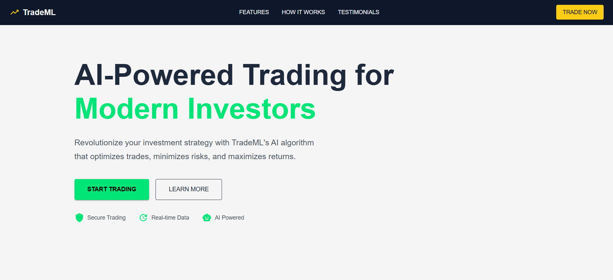
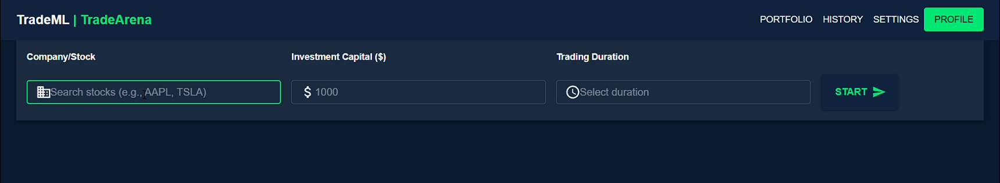
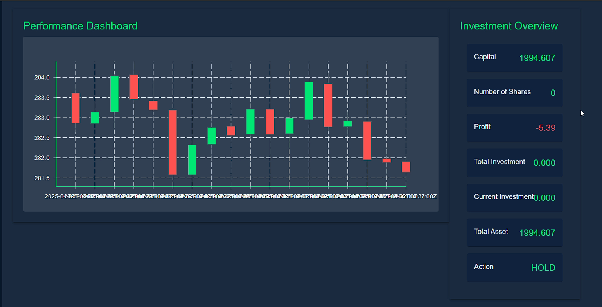

# TradeML: AI-Powered Auto-Trading System



## 📌 Overview
TradeML is an AI-driven trading system that leverages **Reinforcement Learning** to execute automated trades in real-time. The system is designed to help investors optimize their trading strategies with minimal manual intervention. It integrates a **React-based frontend**, a **Node.js backend**, and a **Flask inference server** for serving the model which makes the decision.

---
## 🔥 Features
- **AI-powered trading automation** using reinforcement learning.
- **Real-time stock data visualization** with candlestick charts.
- **User-friendly UI** for selecting trading parameters (Company, Capital, Duration).
- **WebSocket integration** for real-time updates.
- **Scalable architecture** with React, Node.js, and Flask.

---
## 🏗️ Tech Stack
### Frontend (React.js)
- **React.js** with MaterialUI
- **WebSockets** using socket.io for real-time updates
- Candlestick chart visualization

### Backend (Node.js & Flask)
- **Node.js** (Handles user authentication, session management, and WebSockets)
- **Flask** (Runs the reinforcement learning model for stock prediction)
- **Socket.io** (Handles real-time data exchange)
- **NumPy & Pandas** (For data processing)

### Technology Used
- **Reinforcement Learning** - Deep Neural Network Trained on Deep-Q Learning Algorithm

---
## 📂 Project Structure
```
TradeML/
├── frontend/               # React-based UI
│   ├── src/
|      ├── components/
│   
├── main_server/        # Node.js backend
│   ├── app.js/
│   
├── flask_Server/ # Server serving the AI model
│   ├── app.py    
│   
├── rl_modules/
|   ├── data/
|   ├── my_packages/
|   ├── init_model.ipynb
|   ├── train_model.ipynb
|
├── images/
├── video/
└── README.md               # Documentation
```

---
## 🛠️ Setup Instructions
### 1️⃣ Clone the Repository
```bash
git clone https://github.com/sayak2103/AutoTrade.git
cd AutoTrade
```

### 2️⃣ Install Dependencies
#### 📌 Backend (Node.js)
```bash
cd main_server
npm install
```

#### 📌 Frontend (React.js)
```bash
cd frontend
npm install
```

#### 📌 Flask Inference Server
```bash
cd flask-Server
pip install -r requirements.txt
```

### 3️⃣ Run the Application
#### 🚀 Start the Backend Server
```bash
cd main_server
node app.js
```

#### 🚀 Start the Frontend
```bash
cd frontend
npm start
```

#### 🚀 Start the Flask Inference Server
```bash
cd flask_Server
python app.py
```

---
## 📊 User Interface
### 🏠 Home Page

The landing page is designed to attract young investors with an intuitive UI.

### 📈 TradeArena Page

The **TradeArena** page allows users to input:
- **Company** (Stock symbol)
- **Capital** (Investment amount)
- **Duration** (Time period for trade execution)

It features a **candlestick chart** that visualizes stock data and a dashboard showing investment status.


---
## 🎥 Demo Video

Watch the full demo [here](./video/TradeMLspd3.mp4).

---
## 📧 Contact & Contributions
For any queries or contributions, reach out via:
- Email: 
        Sayak Chowdhury - sayak2103@gmail.com
        Ankesh Hatui - hatuiankesh2018@gmail.com
        Priyabrata Senapati - senapatirana415@gmail.com

---
## 📜 License
This project is licensed under the **MIT License**.

